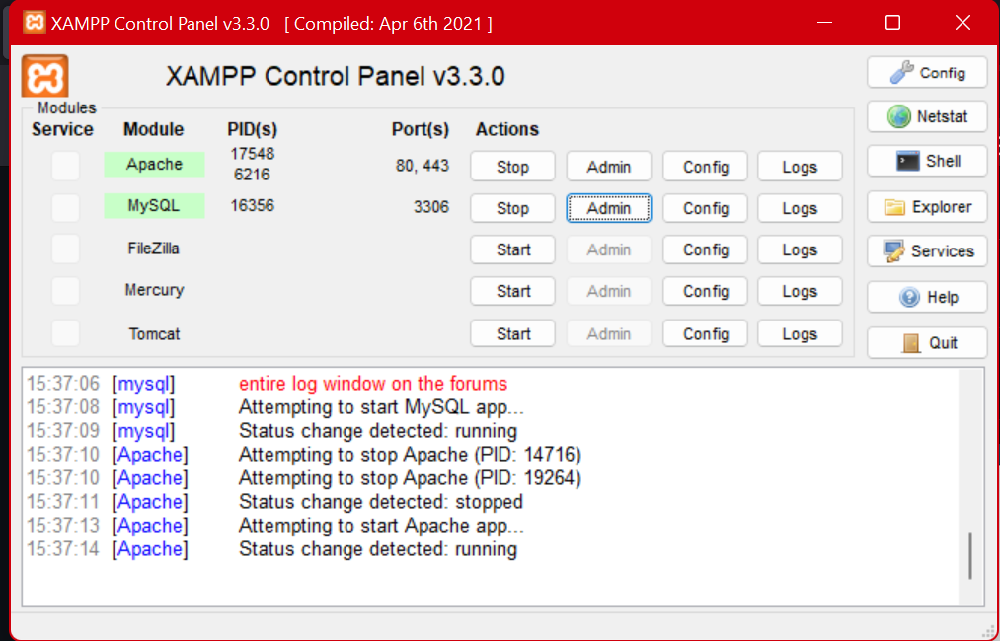
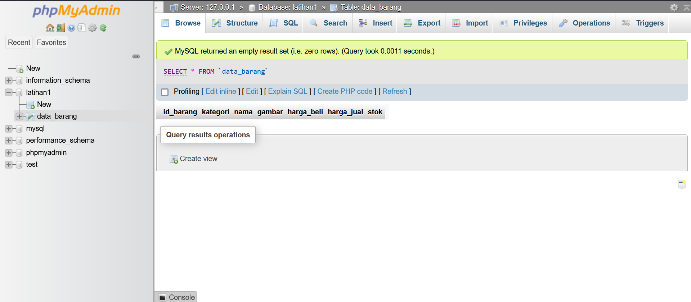
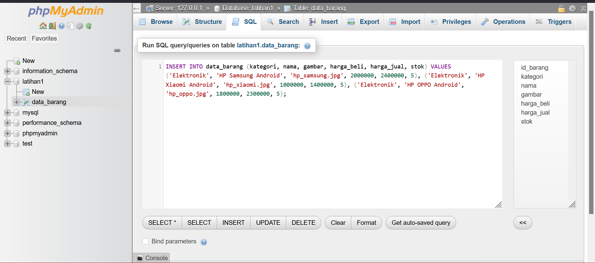
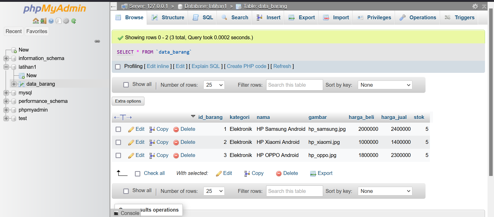
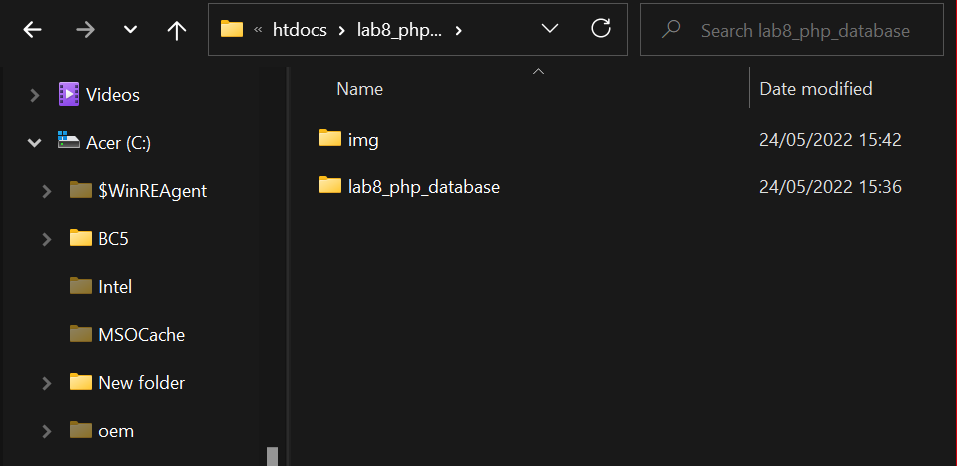
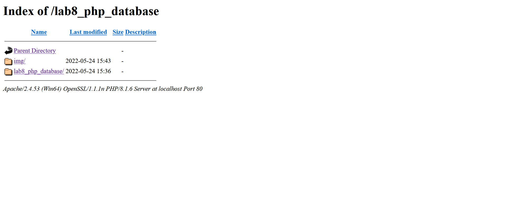
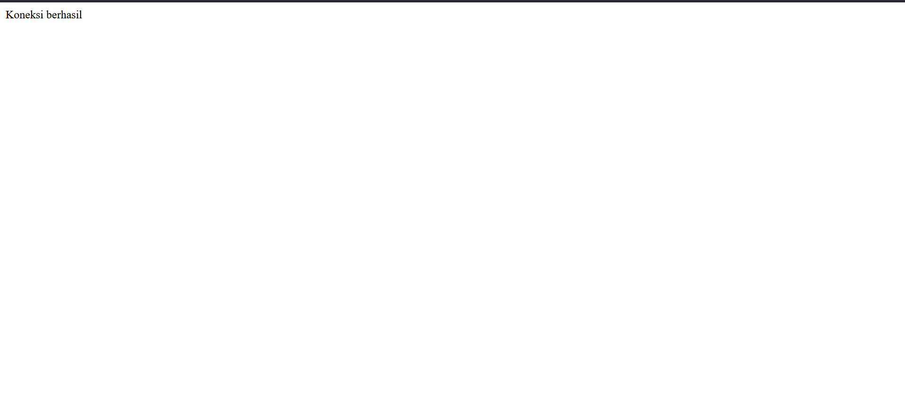
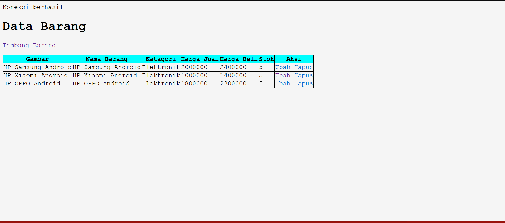
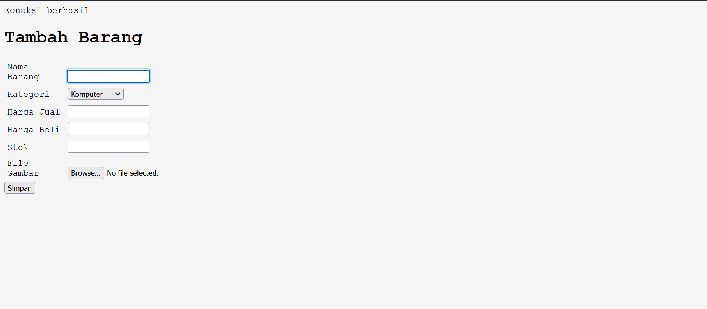

| Muhammad Rifai Aditiya      |   312010065          |
|-------------------| ----------------------|
|Kelas : TI.20.A1 | Bahasa Pemrograman          |

# 1. Menjalankan MySQL Server
Untuk menjalankan MySQL Server dari menu XAMPP Control seperti berikut.

Mengakses MySQL Client menggunakan PHP MyAdmin Pastikan webserver Apache dan MySQL server sudah dijalankan. Kemudian buka melalui browser: http://localhost/phpmyadmin/

# 2.Membuat Database dan Tabel

DATABASE
```mysql
CREATE DATABASE latihan1;
```
TABEL
```mysql
CREATE TABLE data_barang (
    id_barang int(10) auto_increment Primary Key,
    kategori varchar(30),
    nama varchar(30),
    gambar varchar(100),
    harga_beli decimal(10,0),
    harga_jual decimal(10,0),
    stok int(4)
);
```
Hasil nya seperti Berikut


# 3.Menambahkan Data
```mysql
INSERT INTO data_barang (kategori, nama, gambar, harga_beli, harga_jual, stok)
VALUES ('Elektronik', 'HP Samsung Android', 'hp_samsung.jpg', 2000000, 2400000, 5), ('Elektronik', 'HP Xiaomi Android', 'hp_xiaomi.jpg', 1000000, 1400000, 5), ('Elektronik', 'HP OPPO Android', 'hp_oppo.jpg', 1800000, 2300000, 5);
```
Hasilnya seperti berikut. 


# 4 . Membuat CRUD

1.Membuat folder Lab8web di direktori htdocs

2.Lalu buat file dengan nama lab8_php_database , kemudian tambahakan seperti berikut.



Kemudian untuk mengakses direktori tersebut pada web server dengan mengakses URL: http://localhost/Lab8web/lab8_php_database/



# 5.Membuat file koneksi database

Buat file dengan nama koneksi.php lalu tambahkan kode seperti berikut.
```php
<?php
$host = "localhost";
$user = "root";
$pass = "";
$db = "latihan1";
$conn = mysqli_connect($host, $user, $pass, $db);
if ($conn == false){
    echo "Koneksi ke server gagal.";
    die();
}   echo "Koneksi berhasil";
?>
```
Buka melalui browser untuk menguji koneksi database (untuk menyampilkan pesan koneksi berhasil, uncomment pada perintah echo “koneksi berhasil”; Maka hasilnya seperti berikut.



# 6.Membuat file index untuk menampilkan data(Read)

Buat file dengan nama index.php Lalu tambahkan kode berikut.

```php

include("koneksi.php");

// query untuk menampilkan data
$sql = 'SELECT * FROM data_barang';
$result = mysqli_query($conn, $sql);

?>

<!DOCTYPE html>
<html lang="en">
<head>
    <meta charset="UTF-8">
    <meta http-equiv="X-UA-Compatible" content="IE=edge">
    <meta name="viewport" content="width=device-width, initial-scale=1.0">
    <link rel="stylesheet" href="style.css" type="text/css" />
    <title>Data Barang</title>
</head>
<body>
    <div class="container">
        <h1>Data Barang</h1>
        <div class="main">
            <a href="tambah.php">Tambah Barang</a>
            <table>
            <tr>
                <th>Gambar</th>
                <th>Nama Barang</th>
                <th>Kategori</th>
                <th>Harga Jual</th>
                <th>harga Beli</th>
                <th>Stok</th>
                <th>Aksi</th>
            </tr>
            <?php if($result): ?>
            <?php while($row = mysqli_fetch_array($result)): ?>
            <tr>
                <td>" alt="<?=$row['nama'];?>"></td>
                <td><?= $row['nama'];?></td>    
                <td><?= $row['kategori'];?></td>    
                <td><?= $row['harga_beli'];?></td>    
                <td><?= $row['harga_jual'];?></td>    
                <td><?= $row['stok'];?></td>    
                <td><?= $row['id_barang'];?></td>    
            </tr>
            <?php endwhile; else: ?>
            <tr>
                <td colspan="7">Belum ada data</td>
            </tr>
            <?php endif; ?>
            </table>
        </div>
    </div>
</body>
</html>
```
Maka hasilnya seperti berikut.


# 6. Membuat file index untuk menampilkan data(Read)

Buat file dengan nama index.php Lalu tambahkan kode berikut.
```php
<?php
include("koneksi.php");

// query untuk menampilkan data
$sql = 'SELECT * FROM data_barang';
$result = mysqli_query($conn, $sql);

?>

<!DOCTYPE html>
<html lang="en">
<head>
    <meta charset="UTF-8">
    <meta http-equiv="X-UA-Compatible" content="IE=edge">
    <meta name="viewport" content="width=device-width, initial-scale=1.0">
    <link rel="stylesheet" href="style.css" type="text/css" />
    <title>Data Barang</title>
</head>
<body>
    <div class="container">
        <h1>Data Barang</h1>
        <div class="main">
            <a href="tambah.php">Tambah Barang</a>
            <table>
            <tr>
                <th>Gambar</th>
                <th>Nama Barang</th>
                <th>Kategori</th>
                <th>Harga Jual</th>
                <th>harga Beli</th>
                <th>Stok</th>
                <th>Aksi</th>
            </tr>
            <?php if($result): ?>
            <?php while($row = mysqli_fetch_array($result)): ?>
            <tr>
                <td>" alt="<?=$row['nama'];?>"></td>
                <td><?= $row['nama'];?></td>    
                <td><?= $row['kategori'];?></td>    
                <td><?= $row['harga_beli'];?></td>    
                <td><?= $row['harga_jual'];?></td>    
                <td><?= $row['stok'];?></td>    
                <td><?= $row['id_barang'];?></td>    
            </tr>
            <?php endwhile; else: ?>
            <tr>
                <td colspan="7">Belum ada data</td>
            </tr>
            <?php endif; ?>
            </table>
        </div>
    </div>
</body>
</html>
```
Maka hasilnya seperti berikut.


